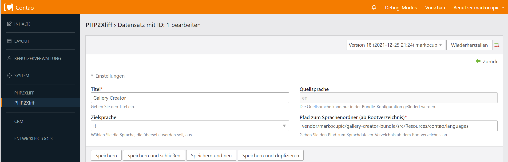
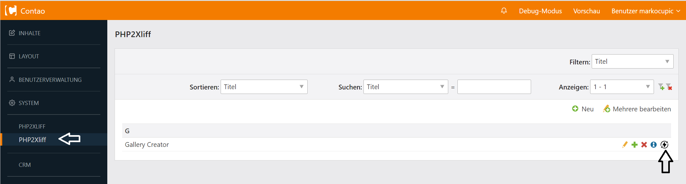

<p align="center"><a href="https://github.com/markocupic"></a></p>

# Generate XLIFF translation files from PHP array translation files
This little handy Contao backend extension simply converts contao php translation files into their xliff (*.xlf) pendants.
 The newly generated files will be stored side by side to the already existing php files.
 Already existing *.xlf files will be overwritten.




# Changing the source language
The source language for all Contao Core XLIFF files is english (en).
 If you like to change this setting you have to do that in your project config in `config/config.yml`.

```yaml
# config/config.yml
markocupic_contao_php2xliff:
  sourceLanguage: it # Switch the source language to Italian
```

# Transifex hints

### Install
Navigate to your project root. Then run:
```
git clone http://code.transifex.com/transifex-client
cd transifex-client
py setup.py install
```
Navigate to newly created transifex-client directory and install [transifex-client](https://docs.transifex.com/client/installing-the-client#installing-the-client-from-source).
```
cd transifex-client
py setup.py install
```


### Initialize and config

Navigate to the repository root e.g. `cd vendor/vendorname/bundlename`
Init transifex `tx init`. Transifex will create a basic config file in `vendor/vendorname/bundlename/.tx`
Edit the config file and add entries for each translation file.

Use `markocupic/contao-php2xliff` to generate xliff translation files from Contao PHP array translation files.

### Push

Upload/Update source files: `tx push -s`

Upload/Update translations files: `tx push -t`

Or upload/update both: `tx push -s -t`

Upload/Update translations files and **force upload**: `tx push -t -f`

[Transifex Push Documentation](https://docs.transifex.com/client/push)

### Pull
Pull source files (force overriding): `tx pull -s -f`

Pull translation files (force overriding): `tx pull -t -f`

[Transifex Pull Documentation](https://docs.transifex.com/client/pull)
